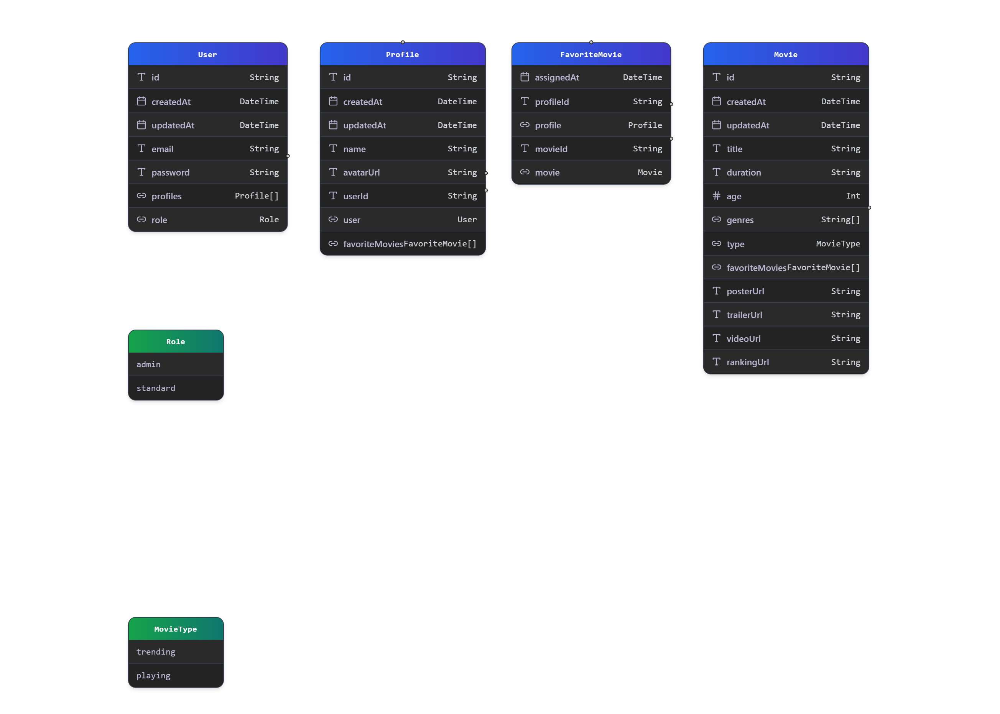

# 🎞️ Nextflix - Netflix Clone 🍿

## Environment variables:

<details>
<summary>
<strong>Click to view variables</strong>
</summary>

-         AUTH_SECRET
-         DATABASE_URL
-         NEXT_PUBLIC_CLOUDINARY_CLOUD_NAME
-         NEXT_PUBLIC_CLOUDINARY_API_KEY
-         CLOUDINARY_API_SECRET

</details>

## Set Up Instructions:

<details>
<summary>
<strong>Click to view instructions</strong>
</summary>

- Download dependencies by running:

          pnpm install

- Start up the app using:

          pnpm run

</details>

## User credentials:

<details>
<summary>
<strong>Click to view credentials</strong>
</summary>

- You can use any one of the following credentials:

  ```text
  email: user1@example.com
  password: Abc123*
  ```

  ```text
  email: user2@example.com
  password: Xyz789*
  ```

- Or register a new user with a **valid** email and password:

</details>

## UML Diagram:

<details>
<summary>
<strong>Click to view diagram</strong>
</summary>



</details>
